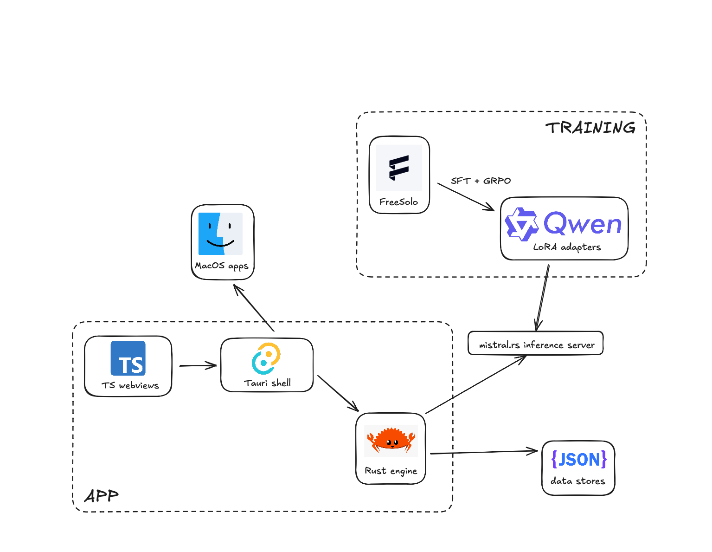

# Quip

Quip is a local macOS writing tool that expands shorthand, fixes messy typing, and uses nearby context to suggest what you meant. It combines a real trained model path, Freesolo LoRA adapters, local inference, and per-user learning instead of another cloud autocomplete wrapper.

